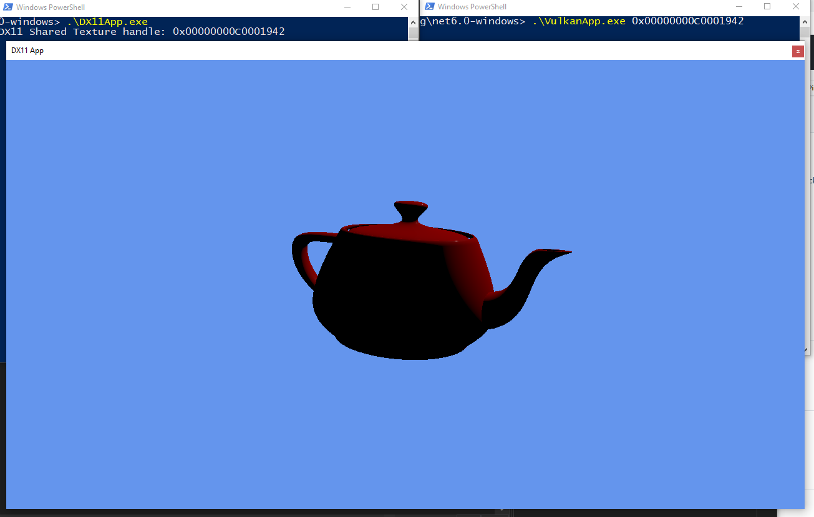

# DirectX and Vulkan interop
This is a demo using [Evergine](https://evergine.com/) to check share resource between DirectX and Vulkan using the **VK_NV_external_memory** vulkan extension.

For more details about this demo read this article.

## References

- [Getting Vulkan Ready For VR by James Jones and Mathias Schott](https://developer.nvidia.com/getting-vulkan-ready-vr)
- [Surface sharing between Windows graphics APIs](https://docs.microsoft.com/en-us/windows/win32/direct3darticles/surface-sharing-between-windows-graphics-apis)